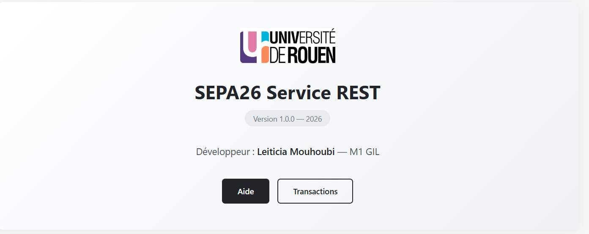
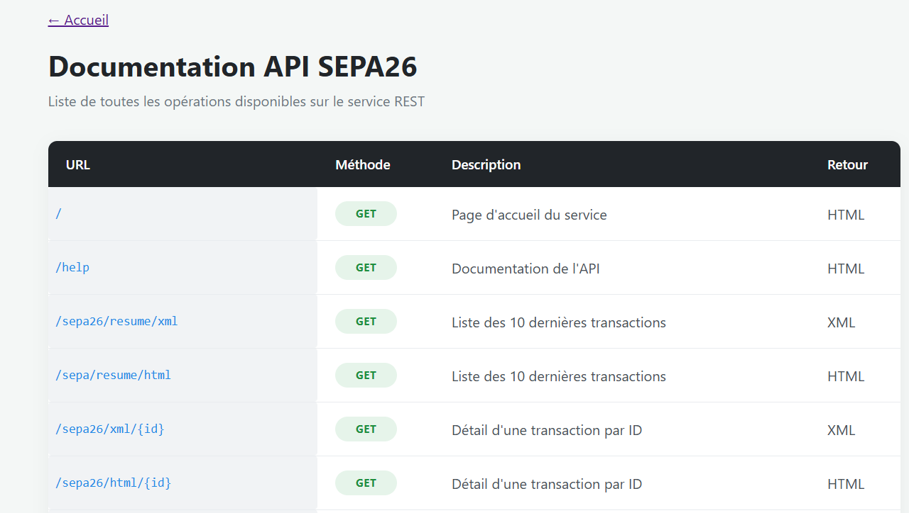
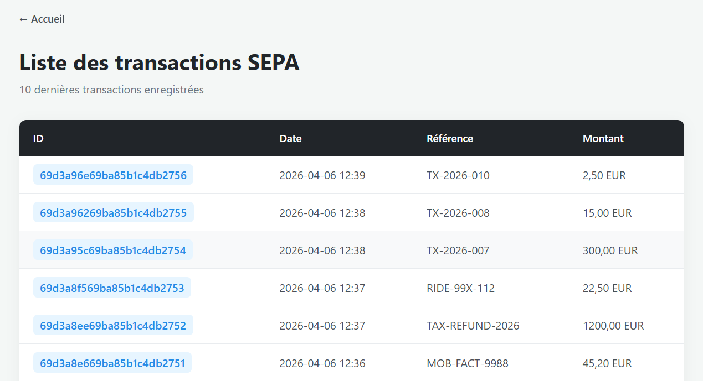
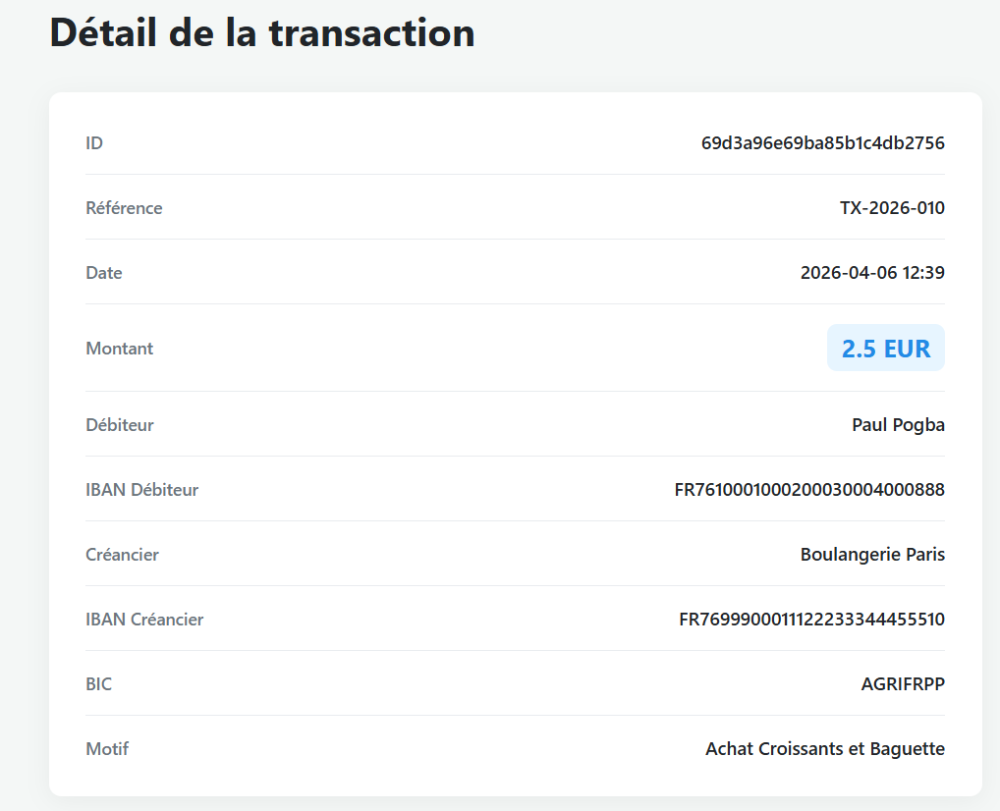

# sepa26 - Service REST Spring Boot

Service REST basé sur **Spring Boot** permettant de gérer et publier des flux XML au format **ISO 20022 (SEPA)**. Le projet implémente les opérations CRUD via les méthodes HTTP (GET, POST, DELETE) et expose des données structurées en XML et HTML. Les transactions SEPA sont persistées dans une base de données **MongoDB**.

---

## Aperçu de l'application

Voici quelques vues de l'interface générée par le service :

### Page d'accueil du service REST


### Documentation intégrée répertoriant les routes disponibles


### Affichage des 10 dernières transactions enregistrées


### Vue détaillée d'une transaction spécifique


---

##  Technologies utilisées

| Technologie | Version |
|---|---|
| Java | 21 |
| Spring Boot | 4.0.3 |
| Maven | 3.9.x |
| Jakarta XML Bind (JAXB) | - |
| MongoDB | 7 |
| Docker & Docker Compose | - |
| Jenkins | 2.541.3 |

---

##  Structure du projet

```
sepa26/
├── src/
│   ├── main/
│   │   ├── java/fr/univrouen/sepa26/
│   │   │   ├── controllers/      # Contrôleurs REST
│   │   │   ├── model/            # Modèles SEPA & MongoDB
│   │   │   ├── repository/       # Repository Spring Data
│   │   │   └── Application.java  # Point d'entrée
│   │   └── resources/
│   │       ├── static/           # Assets statiques
│   │       └── application.properties
│   └── test/                     # Tests JUnit
├── Dockerfile
├── docker-compose.yml
├── bruno/                        # Collection de tests API
├── doc/                          # Captures d'écran
└── pom.xml
```

---

##  Prérequis

- **Java 21**
- **Maven 3.9+**
- **Docker et Docker Compose** (pour le déploiement local de la base de données et du service)

---

##  Installation et lancement

### 1. Cloner le projet
```bash
git clone <url-du-depot>
cd sepa26
```

### 2. Lancer l'environnement avec Docker Compose
L'ensemble de l'infrastructure (la base de données MongoDB et l'application Spring Boot) est conteneurisé. Pour tout démarrer en une seule commande :

```bash
docker-compose up -d
```

> [!NOTE]
> Le fichier `docker-compose.yml` inclus dans le projet se charge de configurer automatiquement les variables d'environnement, les volumes pour la persistance des données et les ports d'écoute.

Le service sera ensuite accessible sur **http://localhost:8100**.

### Alternative : Lancement manuel (Développement)
Si tu souhaites lancer l'application localement via Maven pour le développement, monte d'abord la base MongoDB puis lance Spring Boot :

```bash
docker-compose up -d mongodb
mvn spring-boot:run
```

---

##  Routes disponibles

L'API expose plusieurs points d'entrée pour interagir avec les données.

### GET (Consultation)
- `/` : Page d'accueil du service.
- `/help` : Documentation de l'API.
- `/sepa/resume/xml` et `/sepa/resume/html` : Liste des dernières transactions enregistrées, au format XML ou HTML.
- `/sepa26/xml/{id}` et `/sepa26/html/{id}` : Détail d'une transaction spécifique par son identifiant.
- `/transactions/all` : Liste brute de toutes les transactions stockées en base.

### POST (Création / Traitement)
- `/testpost` : Reçoit et valide un flux XML SEPA.
- `/transactions/save` : Sauvegarde une nouvelle transaction en base de données.

### DELETE (Suppression)
- `/transactions/{id}` : Supprime une transaction spécifique.

---

##  Tester l'API (Dossier Bruno)

Pour faciliter les tests des différentes requêtes (notamment les POST nécessitant des corps de requête spécifiques en JSON ou XML), une collection complète a été préparée.

1. Installe le client API **Bruno** ([https://www.usebruno.com](https://www.usebruno.com)).
2. Ouvre Bruno et clique sur **"Open Collection"**.
3. Sélectionne le dossier `bruno/` situé à la racine de ce projet.
4. Tu y trouveras toutes les requêtes préconfigurées avec les bons headers et payloads d'exemple.

---

##  Format des données et Persistance

### Format XML ISO 20022
Le cœur de l'application repose sur la manipulation de la norme **ISO 20022** pour les prélèvements SEPA. La sérialisation et la désérialisation de ces flux XML complexes sont gérées automatiquement par **JAXB** via des annotations spécifiques dans le modèle de données (telles que `@XmlRootElement`, `@XmlElement`, etc.).

### Persistance MongoDB
Les données extraites des flux XML sont sauvegardées dans **MongoDB**. Les documents sont mappés directement depuis les classes Java grâce aux annotations Spring Data (`@Document`, `@Id`). La persistance des données entre les redémarrages est assurée par un volume Docker configuré dans le projet.

---

##  Intégration Continue avec Jenkins

Le cycle de vie du projet est automatisé via Jenkins, structuré autour de deux jobs principaux :

1. **Construction Maven** : Se déclenche automatiquement à chaque push sur le dépôt Git. Il compile le code, exécute les tests unitaires (`mvn test`) et package l'application. En cas de succès, il déclenche le job suivant.
2. **Service Docker** : Reconstruit l'image Docker de l'application avec les dernières modifications, supprime l'ancien conteneur, et déploie la nouvelle version de manière transparente.

---

##  Annotations utilisées

### Spring
| Annotation | Rôle |
|---|---|
| `@RestController` | Contrôleur REST |
| `@GetMapping` | Mappe les requêtes HTTP GET |
| `@PostMapping` | Mappe les requêtes HTTP POST |
| `@RequestBody` | Désérialise le corps de la requête |

### XML (JAXB)
| Annotation | Rôle |
|---|---|
| `@XmlRootElement` | Définit la balise XML racine |
| `@XmlElement` | Mappe un champ vers une balise XML enfant |
| `@XmlAttribute` | Mappe un champ vers un attribut XML |
| `@XmlAccessorType` | Définit le mode d'accès JAXB |
| `@XmlSchema` | Définit le namespace XML |

### MongoDB
| Annotation | Rôle |
|---|---|
| `@Document` | Mappe la classe vers une collection MongoDB |
| `@Id` | Définit l'identifiant unique du document |

---

##  Tests JUnit

```bash
mvn test
```
